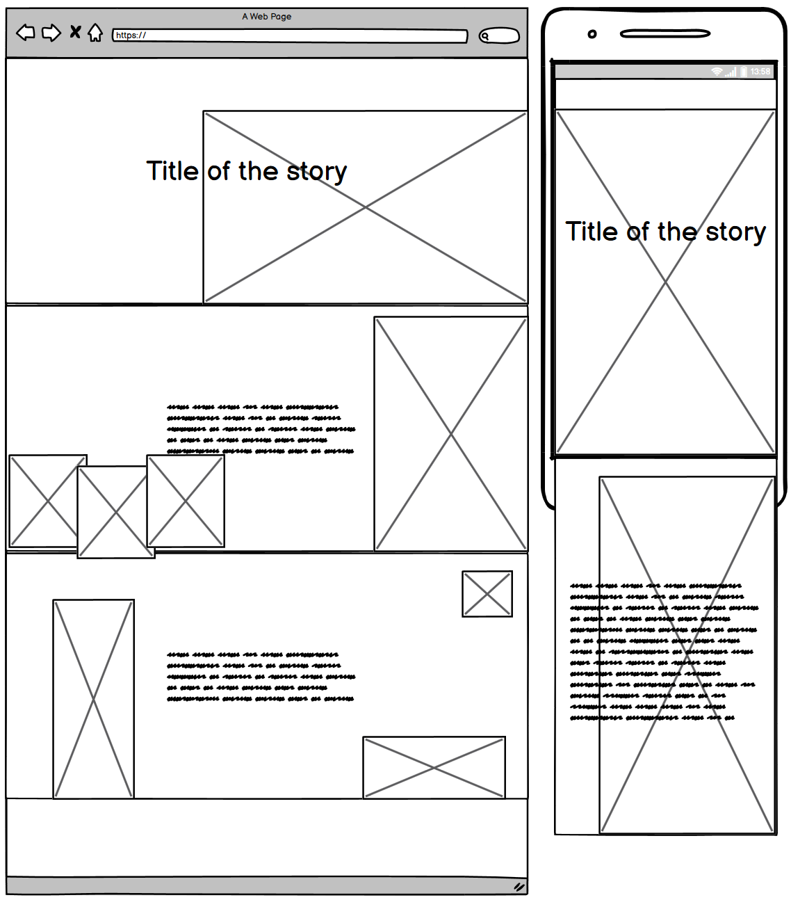
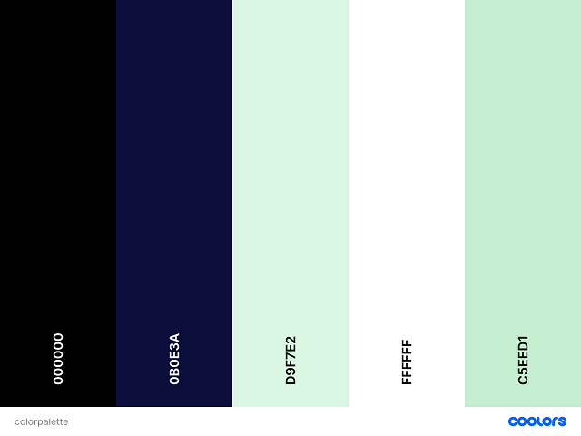
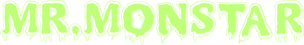
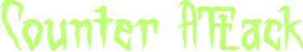
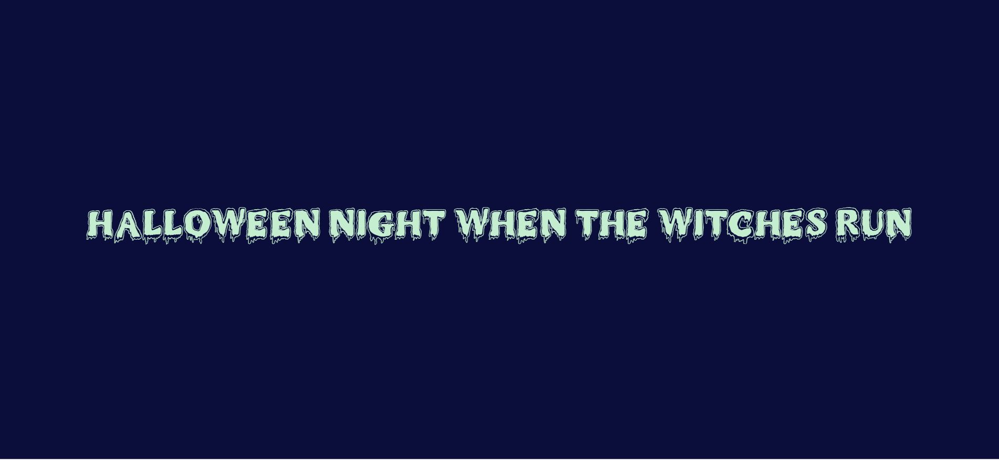
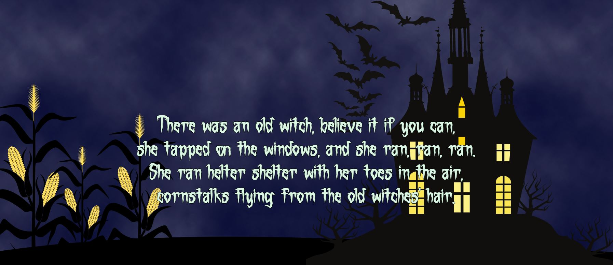
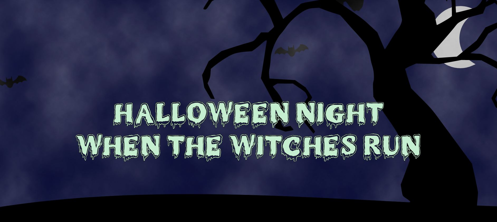

# Halloween Night When The Witches Run

This project was built for the Code Institute Hackathon in October 2021 by the Horrifying Terrible Monster Lurkers (HTML) team.

Please [click here](https://adowlin.github.io/spookathon-team7/) to view the deployed site.

## Index

- [Ux](#ux)
- [Features](#features)
- [Resources](#resources)
- [Testing](#testing)
- [Problems and solutions](#problems-and-solutions)
- [Deployment](#deployment)
- [Credits](#credits)
- [Acknowledgements](#acknowledgements)

## UX
 
### Aims

**Site owner's goal**  
Provide a fun experience for users that visit the site and be able to follow the story smoothly.

**External user’s goal**  
Interact with the HTML Halloween story and be taken through an immersive journey.

### User Stories

As a user I want to be able to: Interact with the HTML Halloween story and be taken through an immersive journey.

### Skeleton

#### Wireframes

Wireframes were created using [Balsamiq](https://balsamiq.com/)

Wireframes for the project below.  

### Surface

**Colours**

The following colours have been used in the creation of the site.

- #0B0E3A - Navy Blue - as the main background colour and to depict the night sky

- #C5EED1 - Light green - used for the header font text and to depict slime - contrasts well against the background colour to enhance readability for the user.

- #D9F7E2 - Light green - used for the story font text and to depict slime - contrasts well against the background colour to enhance readability for the user.

- #0000 - Black - used for the vector images to portray shadows. 

**Typography**

**Heading text**

**Body text**

**Imagery**

---
## Features

### Current features

* Title page:
    * Bats flying across title page with fog in background.
    * Interactive Owl
* Page one:
    * Castle foreground with bats on screen and spooky fog lights for castle.
    * Corn rises up on scroll.
    * Interactive witch
* Page two:
    * Witch on a broomstick with cat and big moon on the 2nd page.
* Page three:
    * Skeleton adorned in flowers
    * Gravestones rise from the ground on scroll
* Page four:
    * Chains imagery
    * Interactive monster
* About Us page:
    * Links to GitHub pages for each of the contributors.

## Languages

* HTML
* CSS
* Javascript

**Libraries and Frameworks**

* Jquery

**IDE, Version control, Repository storage**

* [Git](https://git-scm.com/) - Distributed Version Control tool to store versions of files and track changes.
* [GitPod](https://gitpod.io/) - Workspace IDE.
* [GitHub](https://github.com/) - Hosting service used to manage the Git repositories.

**Resources**

* [Balsamiq](https://balsamiq.com/) was used to create the site's wireframes.
* [Font Awesome](https://fontawesome.com/) was used for the [arrow down](https://fontawesome.com/v5.15/icons/angle-double-down?style=solid) and [arrow up](https://fontawesome.com/v5.15/icons/angle-double-up?style=solid) icons on the site's buttons.
* [Inkscape](https://inkscape.org/) a free and open-source vector graphics editor used to create vector images.
* [Adobe Spark](https://spark.adobe.com/sp/)
* [Adobe Illustrator](https://www.adobe.com/ie/products/illustrator.html) was used to edit some of the artwork.
* [Canva](https://www.canva.com/) was used to create some of the artwork.

## Testing

### Validation

#### HTML
* [W3C HTML Validator](https://validator.w3.org/) was used to validate the HTML on the site. This validator does show warnings that headings are not used in any of the site's sections - this is to be expected as the lack of headers is by design to promote an immersive experience. No errors are present in the HTML code otherwise.

#### CSS
* [W3C CSS Validator](https://jigsaw.w3.org/css-validator/) was used to validate the CSS code in the style.css file. No errors are present.

#### Javascript
* [JSHint](https://jshint.com/) was used to validate the JavaScript code in the script.js file. No errors are present.
* [Esprima](https://esprima.org/demo/validate.html) was also used to validate the JavaScript syntax. Returned result: "Code is syntactically valid".

### Compatibility & Responsiveness
The site was tested across multiple browsers and device types, with no cross-browser compatibility issues to note.

* Browsers tested:
    * Chrome (Windows, macOS, iOS, Android)
    * Safari (macOS, iOS)
    * Microsoft Edge (Windows, macOS)
    * Firefox (Windows, macOS)
    * Samsung Browser (Android)

The site is mostly responsive across a wide range of device sizes. The fog overlay does not scale to cover the entire viewport height on smaller screen sizes, so gaps in the fog are present at the top and bottom of each site section. A fix may be implemented for this in future, but for now it is a known issue due to time constraints. However, this issue does not detract from the story's immersiveness.

### Manual Testing

Manual testing was performed on the following elements that appear on all sections of the site, to ensure all are working as expected;

* Fog: overly images appear and animate on all pages where implemented.

#### Title Page:
* Animated bats spawn and flutter across the screen as expected.
* Interactive Owl displays text and plays hooting sound effects on click as expected.
* "Begin Story" button scrolls to the next section and plays evil laugh sound effect as expected.

#### Story Section 1:
* Witch animation triggers transition across the screen and plays cackle sound effect.
* "Next Page" button scrolls to the next section of the story.

#### Story Section 2:
* Witch graphic animates on scroll to fly diagonally across the section.
* Moon graphic plays howling sound effect on click.
* "Next Page" button scrolls to section 3.

#### Story Section 3:
* Gravestones graphic slides up on scroll.
* Mouseover event on text plays haunting voice sound effect.
* "Next Page" button scrolls to section 4.

#### Story Section 4:
* Mouse enter & leave events on monster graphic magnify & shrink monster as expected.
* "About the Creators" button scrolls to the "About Us" section and plays "Happy Halloween" sound effect when clicked.

#### About Us Section:
* URLs for each collaborator open their GitHub profiles in a new tab.
* "Back to Top" button scrolls to the Title page when clicked.

## Deployment 

The website was deployed to Github pages via the following steps.
1. Log in to Github and locate the website's repository.
2. Under the repository name click on settings on the top right of the menu.
3. Under the source section select the dropdown 'None' and Master branch.
4. The page will automatically refresh.
5. Scroll back down through the page to locate the now published site link in the "GitHub Pages" section.

### Local Deployment
To run this project using Gitpod, you will need to use the Google Chrome browser, and [a GitHub account](https://github.com/). Then, follow the below steps:

1. Install the [Gitpod Chrome Browser Extension](https://chrome.google.com/webstore/detail/gitpod-dev-environments-i/dodmmooeoklaejobgleioelladacbeki?hl=en)
2. Log in to [Gitpod](https://gitpod.io) using your GitHub account
3. Head to this project's [GitHub Repository](https://github.com/adowlin/spookathon-team7)
4. Click the green "Gitpod" button that now appears in the top right corner of the repository, which creates a new Gitpod workspace using the code from the GitHub
5. In Gitpod, create a branch to push your commits to using `git checkout -b branch_name`.
6. After pushing changes to your branch using `git push origin branch_name`, create a pull request in GitHub.

To run this project using a local IDE, for example VSCode, follow these steps to clone the project:

1. Locate the [project's repository](https://github.com/adowlin/spookathon-team7) in GitHub
2. Above the list of files, click the "Code" button
3. To clone the repository using HTTPS, copy the link under "HTTPS" in the dropdown box
4. Open Git Bash and change the current working directory to the location you want the cloned directory to be
5. Type `git clone`, and paste the URL copied in Step 3, then press enter
6. Your local clone will be created

## Credits
### Copy

### Code

* Fog overlay on all pages adapted from: https://github.com/WebDevSHORTS/Fog-Overlay-Animation
* [CSS Grid Generator](https://cssgrid-generator.netlify.app/)

### Imagery

Images are a combination of graphics generated in [Canva](https://www.canva.com/), and original artwork drawn in [Inkscape](https://inkscape.org/).

### Typography

* MrMonstar font downloaded from: https://www.fontspace.com/mr-monstar-font-f40444
* Counter Attack font downloaded from: https://www.fontspace.com/counter-attack-font-f60802

### Audio

* Sound effects obtained from [zapsplat.com](https://www.zapsplat.com) and [freesoundeffects.com](https://www.freesoundeffects.com/)
* Owl: https://www.zapsplat.com/music/owl-hoot-nighttime-1/
* Cackle: https://www.freesoundeffects.com/free-track/cackle3-466439/ 
* Evil Laugh: https://www.zapsplat.com/music/evil-male-horror-laugh-7/
* Howling: https://www.zapsplat.com/music/werewolf-howls-distant-1/
* Happy Halloween: https://www.zapsplat.com/music/male-voice-creepy-with-reversed-reverb-says-happy-halloween-2/
* Spooky Voice: https://www.freesoundeffects.com/free-track/haunting-466386/

## Acknowledgements
